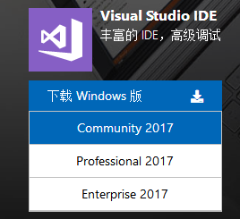
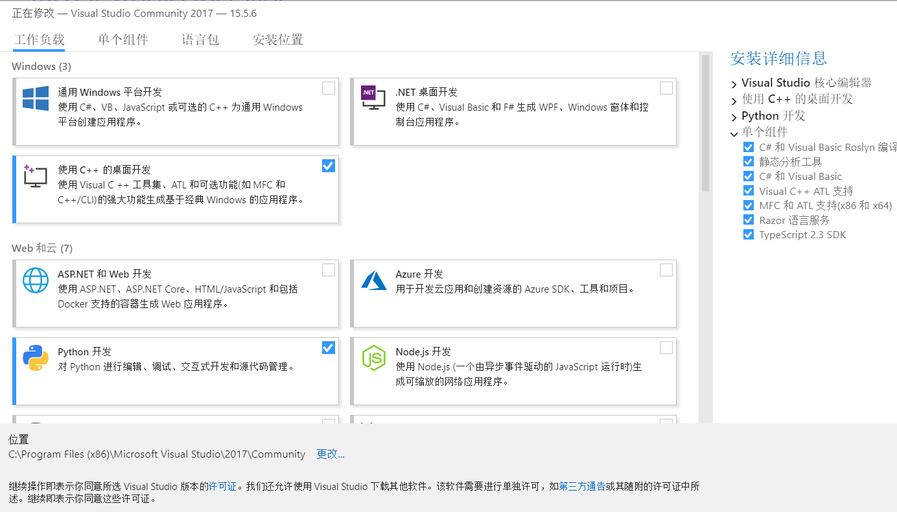
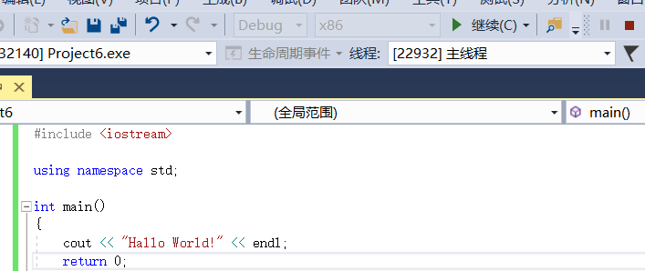

# 遇见Visual Studio

听TA说，get到VS Code就可以获得除了JAVA以外的万能编辑器。   
emmmm, 可是一直用编辑器也不是办法啊，有没有什么更智能的工具呢？  
当然有啊，那就是同样微软出品的Visual Studio啦。  
   
从名字上来看，VS和VS Code像是有扯不清的关系，但两者使用体验是千差万别.  
相比于VS Code，VS是一款IDE，它集成了更多的功能。  
并且值得一提的是，VS也提供了永久免费的版本，并且功能对于我们来说完全够用.  
[点这传送到Visual Studio官网！](https://visualstudio.microsoft.com/zh-hans/)   
找到合适版本下载即可   
  
安装后，通关installer（第一次打开，自动跳出）安装想要的功能（C/C++,Python,HTML等)。  
 
除了JAVA以外的大部分编程语言都可以在这找到。  
安装完毕以后，点击创建新项目就可以开始编程了啦。 
敲几行代码，点击上面的调试器，就可以运行了。 
 
  
怎么样？是不是很简单？  
附带几个常用的功能:  
1. F5，调试。   
2. F10， 单步调试。
3. 左键点击行号左侧白条， 断点。  
 更多精彩，等待你发现！

 
