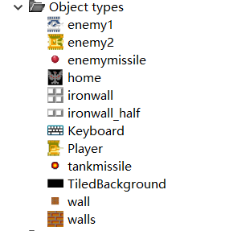
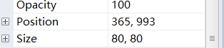
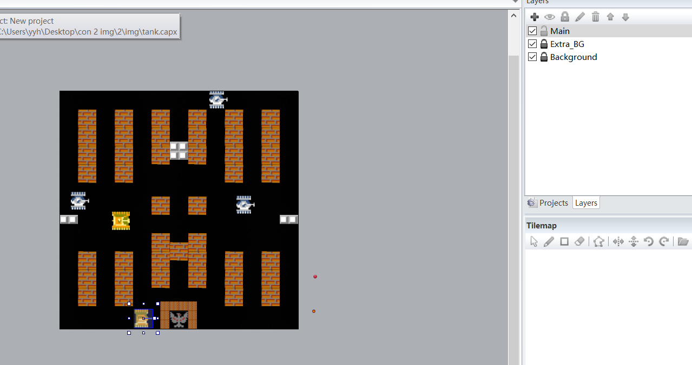
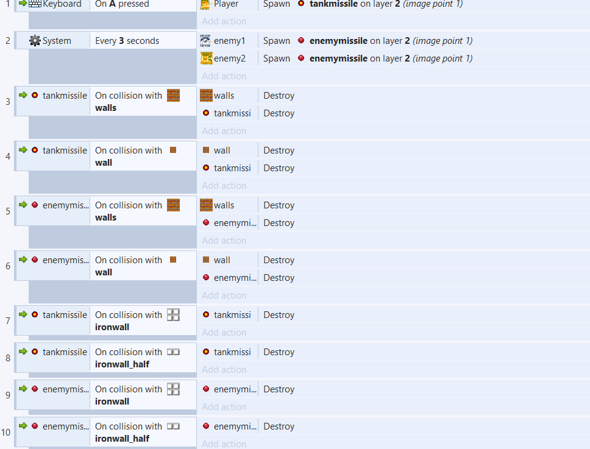
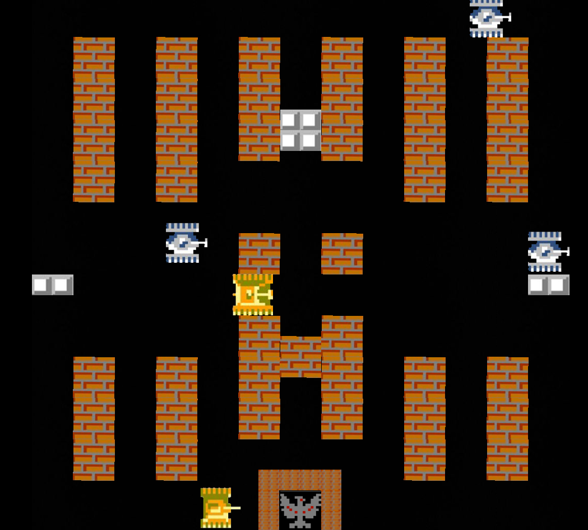
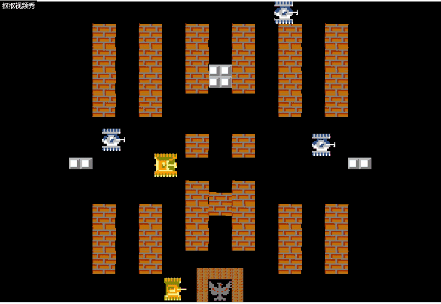

# 使用construct 2创造一个简易坦克大战
第一次接触construct 2，花了一整天的时间啃完了英语教程。  
又用了一整天的时间弄出了这个简易的坦克大战。  
还有很多细节上的地方没有完善，需要长久地学习学习。  
那我现在就来简单的说一下制作过程。  
## 第一步-将网上找来的素材导入工程中

通过点击空白处来添加素材图，同时添加键盘对象.

## 第二步-设置各图片的层次与位置
通过设置各图片的size与position属性对各图像进行精确定位(屏幕长宽设置为了1040*1040)  
  
  
并在layer栏中设置各图片层次  

## 第三步-各对象的属性与行为

我将玩家的坦克行动方式设为8Direction，但将属性改为4方向行走，且只能90度转身。  
敌方坦克添加了bullet行为以使其能够自动行动，且添加了pathfingding。  
同时也设置了一下各坦克的行动速度以及血量(通过instance variable)，以及子弹的相关属性。  

## 第四步-设置event sheet

这也是最关键的一步，使游戏能跑起来。  
我将键盘A键设置为攻击键，通过spawn使得玩家能发射炮弹，同时重新设置了炮弹发射的位置(从前端射出)。  
然后设置各种碰撞的情况，当子弹碰到普通墙壁时会击毁墙壁，而遇到铁墙时不会，同时摧毁子弹。  
当子弹碰到玩家会导致玩家死亡，碰到家或者敌人则会损血(之前设置的variable)，当血降为0时则会死亡，且家死亡会导致玩家死亡。  
然后为敌人设置自动发射的事件，与转向。

## 第五步-玩起来！

到此这个简易的坦克大战就完成了！  
并且可以初步的游玩。  
  
下面是试玩的gif  

## 第六步-总结

通过制作这个简易的坦克大战，我学会了construct 2的基本操作，且基本具备了通过construct 2独立制作游戏的技能，但仍有许多细节不懂，需要进一步的学习。  
同时列举一下此次的不足之处：  
1. 没有找到优秀的素材，使用的素材存在不平整的现象，导致坦克经过时容易卡住。
2. 敌人设置的不够智能，因为不懂很多东西（baidu也没查到解决办法），于是只能简单的通过时间来发射炮弹和顺时针转向，导致游戏难度较低，需要改进。  
3. 没有做出开始动画和结束动画（主要是还不会做），需要学习。

4. 地图只做了一个，敌人也只有两种，还需改进。

另外附上项目的文件[坦克大战](extra/tank.capx)