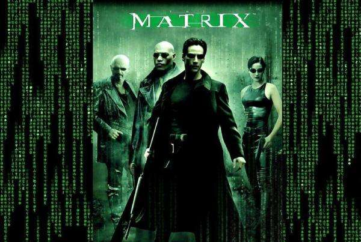
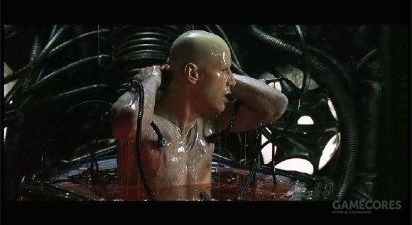
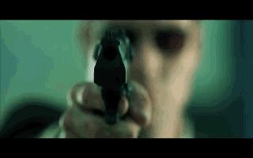
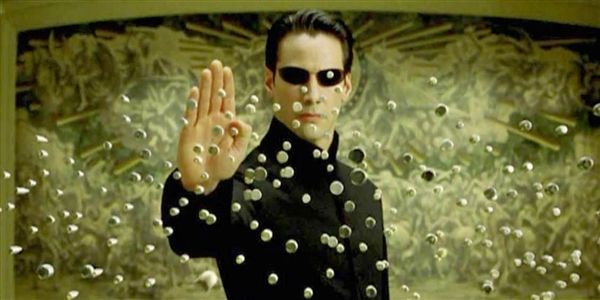
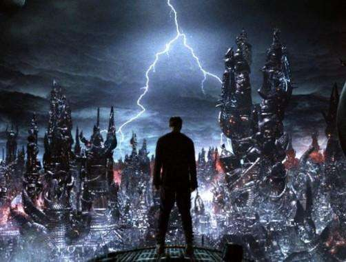

# 真真假假——《黑客帝国》推荐
一说有关IT的电影，脑海中第一个浮现的就是《黑客帝国》。
  
虽然第一次看黑客帝国的时候应该已经是初中的事了，但到如今仍被所震撼。  
黑客帝国主要内容是一位叫尼奥的黑客一直以来就对自己所处的世界觉得奇怪，然而他的怀疑并不是凭空而来的，事实证明他所处的世界并不是真正的现实世界，而是由0和1组成的网络世界——矩阵，同时他也被认定为人类的救世主。随着真相的一步步揭开，世界的真面目也出现在他的面前，原来人类早已被人工智能打败，成为了人工智能生产能量的工具。人类反抗人工的序幕揭开了。
  
接下来的剧情就不展开了，要不然这篇推荐不就成了图解了吗?  
我想要分享的是我的观影体验。  
## 首先，《黑客帝国》优秀的打斗场景令人叹为观止
作为一部末世求生题材的电影，打斗场面自然是少不了的，黑客帝国也诞生了许多经典的打斗场面，尤其是尼奥刚觉醒后躲子弹的那一幕，帅气十足。  
   
其他的优秀场景也层出不穷，真的可以算是大场面。  
   
## 其次，跌宕起伏的剧情让人应接不暇
首先，虚拟世界这个设定就已经很让人吃惊了，但是还远远不止。尼奥后来居然可以在现实世界中使用能力，使得人浮想联翩。尼奥拼命赶到矩阵的中心才知道原来尼奥本来就是人工智能创造出来的救世主，为的就是一次又一次的培养和摧毁锡安和人类以此来修复矩阵世界的BUG。同时尼奥曾经杀死的一个程序居然变异成为了boss，还同化先知威胁到了两个世界。最后尼奥以牺牲为代价为人类赢得了与人工智能共处的机会也出乎意料。接踵而至的惊喜却没有明显的漏洞，《黑客帝国》的剧情可谓精彩。

## 最后，《黑客帝国》令人深思
如今，我们也在大力发展人工智能，黑客帝国会不会成为未来的预演呢？我们是不是也要有所准备呢？一项革命性的技术若掌握不好也可能会演变成为毁灭世界的武器，无论是《毁灭者》中的天网，还是《黑客帝国》中的人工智能。科幻电影的存在本身就是人类对未来的各种思考，其存在会对人类的发展有引导的作用。若不做防备，很有可能未来的我们也将生活在培养器中当电池了。  
谁又知道我们现在的世界不是一个矩阵世界呢？
