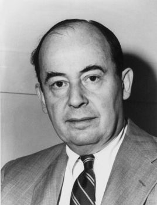

# 关于冯·诺依曼结构  
从第一节导论课开始，老师就一直有提到冯·诺伊曼体系结构，现代计算机基本上是沿用的冯·诺伊曼体系结构。那么，什么是冯·诺伊曼体系结构？为什么会是冯诺伊曼体系结构呢？  
## 什么是冯·诺伊曼体系结构？  
要了解什么是冯·诺伊曼体系结构，我们首先得了解一下这位计算机界的大佬，冯·诺伊曼。  
  
约翰·冯·诺伊曼，原名诺依曼·亚诺什·拉约什，出生于匈牙利的美国籍犹太人数学家，现代电子计算机与博弈论的重要创始人，在泛函分析、遍历理论、几何学、拓扑学和数值分析等众多数学领域及计算机学、量子力学和经济学中都有重大贡献(参考维基百科)。  
在通过维基百科的简介我们可以基本了解冯诺依曼了不起的成就。而冯诺依曼体系结构是冯诺依曼参与第一台电子计算机ENIAC的设计并与团队讨论下一代计算机EDVAC的结构时总结而成的，因此冯诺依曼结构严格来说并不是由冯诺依曼独自完成的，而是他首先发表（因为这事，冯诺依曼与EDVAC团队决裂，当然，这是后话了）。  
冯·诺伊曼结构最显著的特点就是将计算机结构分成了五个部分即I/O,存储器，运算器，控制器， 其也被称为存储程序式计算机。   
    
更加细致地说冯诺依曼结构
1. 采用存储程序方式，指令和数据不加区别混合存储在同一个存储器中，即指令与数据在内存中主要通过控制器的指针进行操作（例如像X86里的SP,IP等寄存器），且在每个内存段中包含了读写权限等信息。
2. 存储器是按地址访问的线性编址的一维结构，每个单元的位数是固定的。在我们编程时，一般是将内存作为一段一段的使用，而对于计算机而言，其实就是一条直线。
3. 指令由操作码和地址组成。操作码指明本指令的操作类型,地址码指明操作数和地址。操作数本身无数据类型的标志，它的数据类型由操作码确定。
4. 通过执行指令直接发出控制信号控制计算机的操作。指令在存储器中按其执行顺序存放，由指令计数器指明要执行的指令所在的单元地址。指令计数器只有一个，一般按顺序递增，但执行顺序可按运算结果或当时的外界条件而改变。
5. 以运算器为中心，I/O设备与存储器间的数据传送都要经过运算器。
6. 数据以二进制表示，大大提高了存储效率。
## 为什么会是冯·诺伊曼结构？
计算机结构理论有很多，除了冯诺依曼结构还有哈佛结构等，然而冯诺依曼最终成为了计算机主流结构，为什么会这样呢？  
其他计算机结构  
冯·诺伊曼结构最大的突破就是将程序与数据不加区分的储存在存储器中，而这一特点，使得编写程序，运行程序变得简单。因为指令与数据都在储存器中，计算机可以快速读取指令执行计算任务，大大提高了运算速度。恐怕这就是冯·诺伊曼结构最高明的地方了。