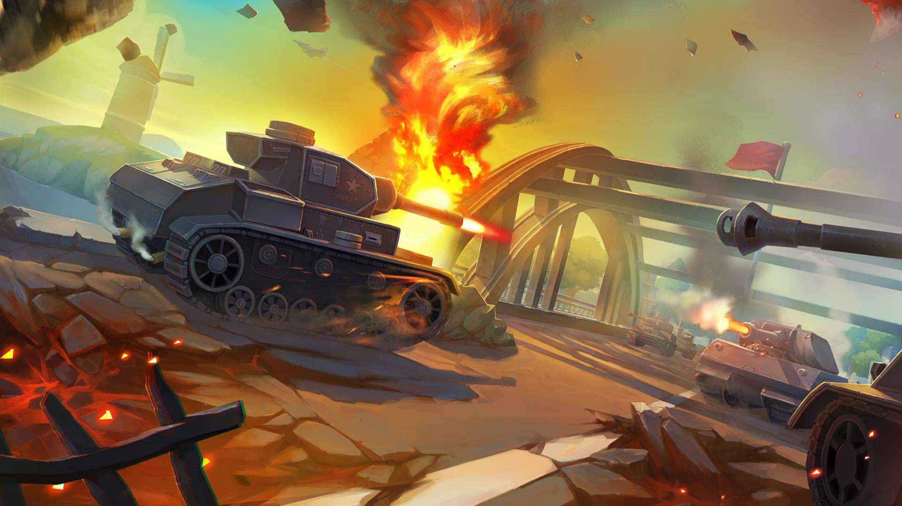

# 坦克大战游戏策划及设计

（本次项目中的坦克大战使用项目二中的简易坦克大战）
## 游戏策划
玩法(Gameplay)：玩家操作坦克击败敌方NPC，保护己方基地。 
  
人设与道具（Game Sprites）：  
1. Player:黄色小坦克，允许上下左右四个方向运动，只有一格血，可以向前发射炮弹。  

2. home: 鹰形标志，非常脆弱，只有三格血，毁灭后游戏结束。  

3. enemy1: 普通敌人，银色小坦克，拥有三格血，会向前发射导弹。  

4. enemy2: 精英敌人，金色大坦克，拥有五格血，会向前发射导弹。  

5. walls: 土墙与铁墙，土墙可摧毁，铁墙不可摧毁。  

地图参考的是经典坦克大战的第一关

## 游戏设计  

| Object | Keyboard |  
| ------ | ------ |  
| Attributues |  |  
|   | every 3s&enemy1发射导弹 |  
|   | every 3s&enemy2发射导弹 |  
|   | every 7s&enemy1旋转90度 |  
|   | every 7s&enemy2旋转90度 |

| Object | System |  
| ------ | ------ |  
| Attributues |  |  
| A  | press&Player发射导弹 |  

| Object | Player |  
| ------ | ------ |  
| Attributues | 图片,位置 |  
| enemymissile | 碰撞&销毁自己 |   

| Object | enemy1 |  
| ------ | ------ |  
| Attributues | 图片,位置 |  
| tankmissile | 碰撞&health-1 |   
|  | health==0&销毁自己 |   

| Object | enemy2 |  
| ------ | ------ |  
| Attributues | 图片,位置 |  
| tankmissile | 碰撞&health-1 |   
|  | health==0&销毁自己 |   

| Object | home |  
| ------ | ------ |  
| Attributues | 图片,位置 |  
| tankmissile | 碰撞&health-1 |   
| enemymissile | 碰撞&health-1 |   
|  | health==0&销毁自己 |   

| Object | tankmissle |  
| ------ | ------ |  
| Attributues | 图片,位置 |  
| 精灵 | 碰撞&销毁自己 |   

| Object | enemymissle |  
| ------ | ------ |  
| Attributues | 图片,位置 |  
| 精灵 | 碰撞&销毁自己 |   

| Object | wall |  
| ------ | ------ |  
| Attributues | 图片,位置 |  
| enemymissle | 碰撞&销毁自己 |   
| tankmissle | 碰撞&销毁自己 |   

## 游戏试玩

(试玩gif与项目2gif一致)

